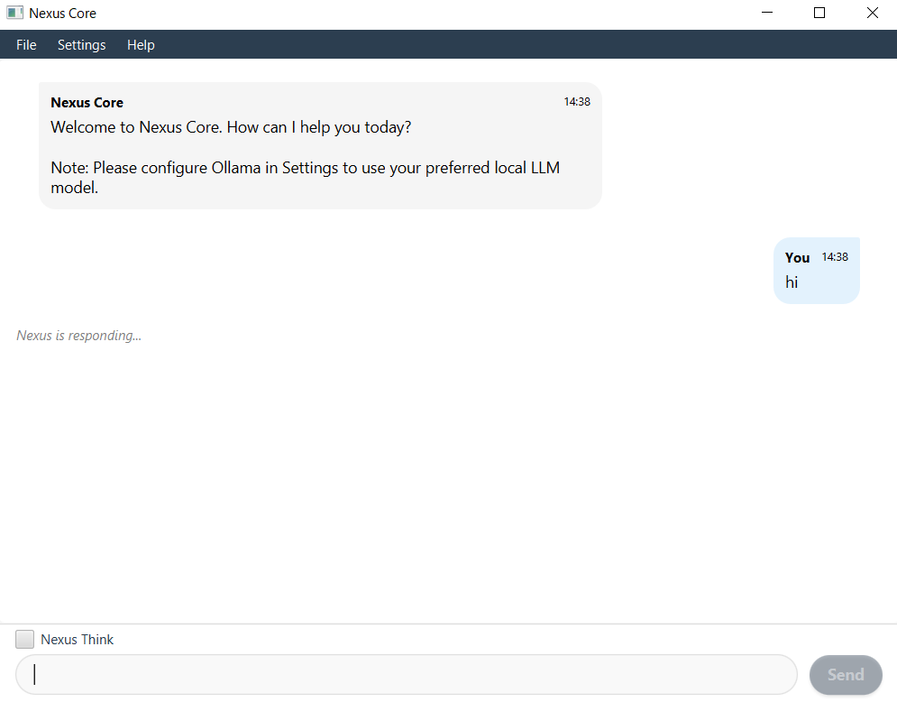

# NexusCore



_A lightweight desktop interface for interacting with Ollama-powered local LLMs_

## Overview

NexusCore is a Java-based desktop application that provides a clean, intuitive interface for communicating with local Large Language Models (LLMs) through Ollama. It offers both a GUI mode with a modern chat interface and a command-line interface for flexibility.

## Features

- **Modern Chat Interface**: Easy-to-use chat UI with message bubbles and intuitive controls
- **Local LLM Integration**: Connect to any model installed through Ollama
- **Nexus Think Mode**: Enhanced responses that consider conversation history
- **Local Data Storage**: All conversations are stored locally in SQLite database
- **Multi-language Support**: Full internationalization support with Japanese interface elements
- **Cross-Platform**: Runs on Windows, macOS, and Linux

## Requirements

- Java 17 or later
- [Ollama](https://ollama.ai/) installed with at least one model

## Installation

1. Download the latest release from the [releases page](https://github.com/yourusername/nexuscore/releases)
2. Ensure you have Java 17+ installed
3. Install Ollama and pull at least one model:
   ```
   ollama pull llama2
   ```
4. Run NexusCore:
   ```
   java -jar nexuscore-0.1.0.jar
   ```

## Building from Source

```bash
# Clone the repository
git clone https://github.com/yourusername/nexuscore.git
cd nexuscore

# Build with Gradle
./gradlew build

# Run the application
./gradlew run
```

## Usage

### GUI Mode

The GUI mode launches by default and provides a chat interface for interacting with your local LLMs.

1. Configure your Ollama settings through Settings → Preferences
2. Type your message in the input field and press Send
3. Toggle "Nexus Think" for more contextually aware responses

### CLI Mode

For terminal usage, launch with the `--cli` or `-c` flag:

```
java -jar nexuscore-0.1.0.jar --cli
```

## Configuration

NexusCore can be configured via the Settings menu:

- **Ollama Path**: Path to the Ollama executable
- **Model Selection**: Choose which installed Ollama model to use
- **Temperature**: Adjust the randomness of responses

## Project Structure

```
nexuscore/
├── app/                         # Main application code
│   ├── src/main/java/
│   │   └── com/nexuscore/
│   │       ├── database/        # Database management
│   │       ├── gui/             # JavaFX UI components
│   │       ├── llm/             # LLM service integration
│   │       └── NexusCoreApp.java
│   ├── src/main/resources/
│   │   ├── css/                 # Stylesheets
│   │   ├── fxml/                # UI layout files
│   │   └── ...
│   └── src/test/                # Unit tests
├── gradle/                      # Gradle wrapper
├── .gitignore
├── build.gradle
└── README.md
```

## Database Schema

NexusCore uses SQLite to store conversations and messages:

- **Conversations**: stores conversation metadata
  - `id`: unique identifier
  - `start_time`: when the conversation started
  - `title`: conversation title
- **Messages**: stores individual messages
  - `id`: unique identifier
  - `conversation_id`: references the conversation
  - `timestamp`: when the message was sent
  - `sender`: who sent the message ("User" or "LLM")
  - `content`: the message content

## Contributing

Contributions are welcome! Please feel free to submit a Pull Request.

1. Fork the repository
2. Create your feature branch (`git checkout -b feature/amazing-feature`)
3. Commit your changes (`git commit -m 'Add some amazing feature'`)
4. Push to the branch (`git push origin feature/amazing-feature`)
5. Open a Pull Request

## License

This project is licensed under the MIT License - see the LICENSE file for details.

## Acknowledgments

- [Ollama](https://ollama.ai/) for providing an easy way to run local LLMs
- [JavaFX](https://openjfx.io/) for the UI framework
- [SQLite](https://www.sqlite.org/) for the database engine
